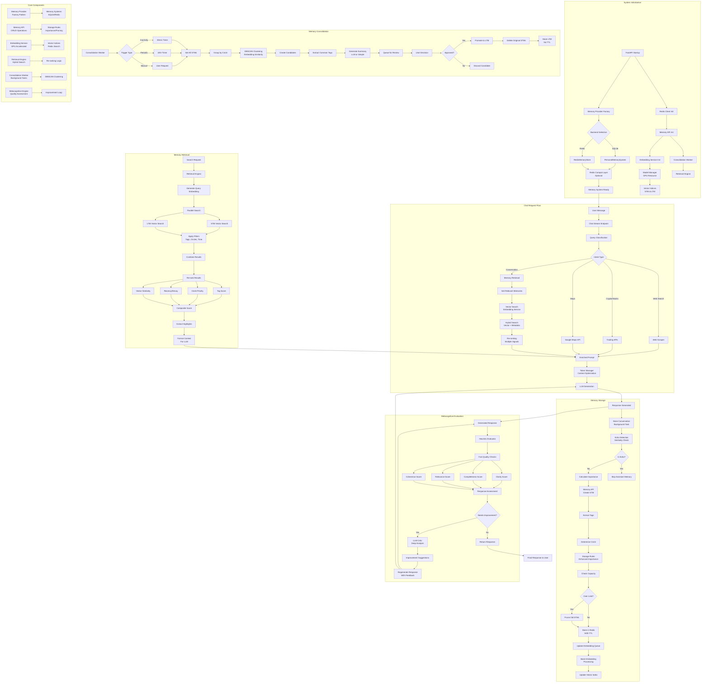

# Neural Consciousness Memory System Flow Chart

## Overview

The Neural Consciousness Chat System implements a sophisticated memory architecture that combines short-term memory (STM), long-term memory (LTM), embeddings, vector search, and metacognitive evaluation. This document visualizes the complete flow from memory initialization through storage, retrieval, consolidation, and response enhancement.

## System Architecture Flow

## Memory System Components

### 1. **Memory Provider Factory** (`memory_provider.py`)
- Switches between Redis and SQLite backends
- Provides compatibility layer for migration
- Configuration-based backend selection

### 2. **Memory API** (`memory/services/memory_api.py`)
- Core CRUD operations for STM and LTM
- Tag extraction and circle determination
- Capacity management and pruning
- Consolidation candidate queuing

### 3. **Embedding Service** (`memory/services/embedding_service.py`)
- GPU-accelerated embedding generation
- Batch processing with caching
- Vector index management (STM & LTM)
- Asynchronous queue processing
- Model management with resource locking

### 4. **Retrieval Engine** (`memory/services/retrieval_engine.py`)
- Hybrid search (vector + metadata)
- Multi-signal re-ranking algorithm
- Context formatting for LLM consumption
- Related memory discovery
- Time-based search capabilities

### 5. **Consolidation Worker** (`memory/services/consolidation_worker.py`)
- Activity monitoring (30-minute inactivity)
- Periodic consolidation (24-hour cycle)
- DBSCAN clustering for similarity grouping
- User-in-the-loop approval system
- Summary generation (LLM or heuristic)

### 6. **Storage Rules Manager** (`memory/services/storage_rules_manager.py`)
- Enhanced importance calculation
- Capacity limit enforcement
- Pruning decision logic
- User approval requirements

### 7. **Metacognitive Engine** (`metacognitive_engine.py`)
- Heuristic evaluation (System 1)
- LLM-based criticism (System 2)
- Quality assessment across dimensions
- Iterative improvement suggestions
- Response regeneration with feedback

## Memory Flow Stages

### Stage 1: Initialization
1. FastAPI startup triggers memory system initialization
2. Memory provider selects backend (SQLite or Redis)
3. Redis client establishes connection
4. Memory API, Embedding Service, and Retrieval Engine initialize
5. Vector indices created for STM and LTM
6. Consolidation worker starts background tasks

### Stage 2: Request Processing
1. User message arrives at chat-stream endpoint
2. Query classification determines intent
3. Memory retrieval searches for relevant context
4. Vector search finds similar memories
5. Re-ranking applies multiple signals
6. Context formatted and integrated into prompt

### Stage 3: Response Generation
1. Token manager optimizes context window
2. LLM generates response stream
3. Response stored as conversation memory
4. Echo detection prevents redundant storage
5. Importance calculation determines memory value
6. Background tasks handle storage asynchronously

### Stage 4: Memory Storage
1. STM created with extracted tags
2. Memory circle determined by content
3. Storage rules calculate enhanced importance
4. Capacity checks trigger pruning if needed
5. Memory stored in Redis with TTL
6. Embedding generation queued for batch processing

### Stage 5: Consolidation Process
1. Worker monitors for inactivity or periodic trigger
2. STMs grouped by memory circles
3. DBSCAN clusters similar memories
4. Candidates created with common tags
5. Summaries generated for user review
6. Approved candidates promoted to LTM

### Stage 6: Metacognitive Evaluation
1. Generated response assessed by heuristics
2. Quality scores calculated across dimensions
3. Low-scoring responses trigger LLM criticism
4. Improvement suggestions generated
5. Response regenerated with feedback
6. Iterative improvement until quality threshold met

## Key Features

### Hybrid Architecture
- Combines rule-based heuristics with LLM intelligence
- Fast path for simple operations
- Deep analysis for complex scenarios

### Scalable Design
- Asynchronous operations throughout
- Background task processing
- GPU resource management
- Connection pooling and caching

### User-Centric Memory
- Importance-based retention
- Context-aware retrieval
- User approval for consolidation
- Echo detection to avoid redundancy

### Quality Assurance
- Multi-dimensional assessment
- Iterative improvement
- Confidence scoring
- Weak area identification

## Performance Optimizations

1. **Batch Processing**: Embeddings generated in batches
2. **Caching**: TTL cache for embeddings
3. **Async Operations**: Non-blocking I/O throughout
4. **Resource Management**: GPU lock prevents contention
5. **Pruning**: Automatic capacity management
6. **Indices**: Vector indices for fast similarity search

## Configuration Points

- Memory backend selection (SQLite/Redis)
- TTL for short-term memories
- Capacity limits for STM/LTM
- Consolidation thresholds
- Embedding model selection
- Quality assessment thresholds

## Integration Points

1. **FastAPI**: Main web framework
2. **Redis**: Vector storage and caching
3. **SQLite**: Alternative memory backend
4. **LLM Server**: Persistent model service
5. **GPU Manager**: Resource allocation
6. **Prometheus**: Metrics collection